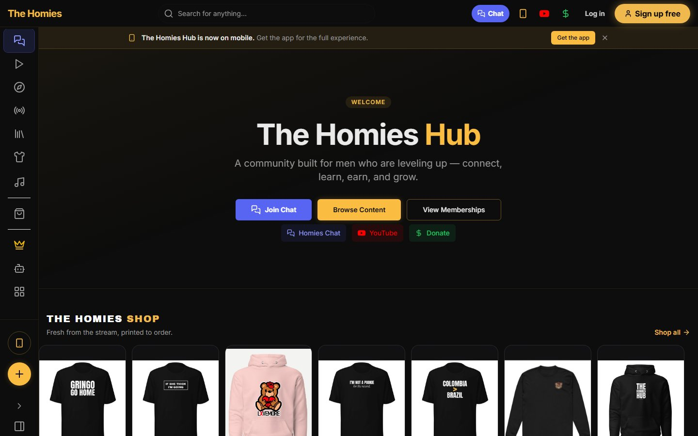
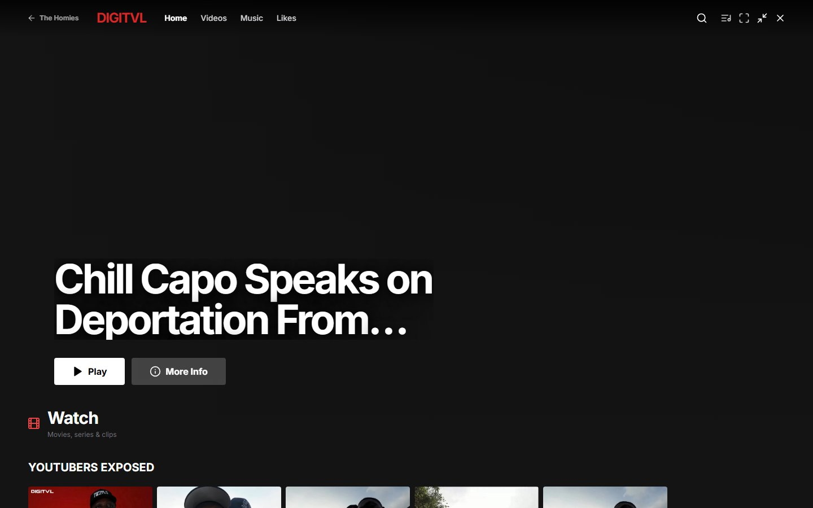
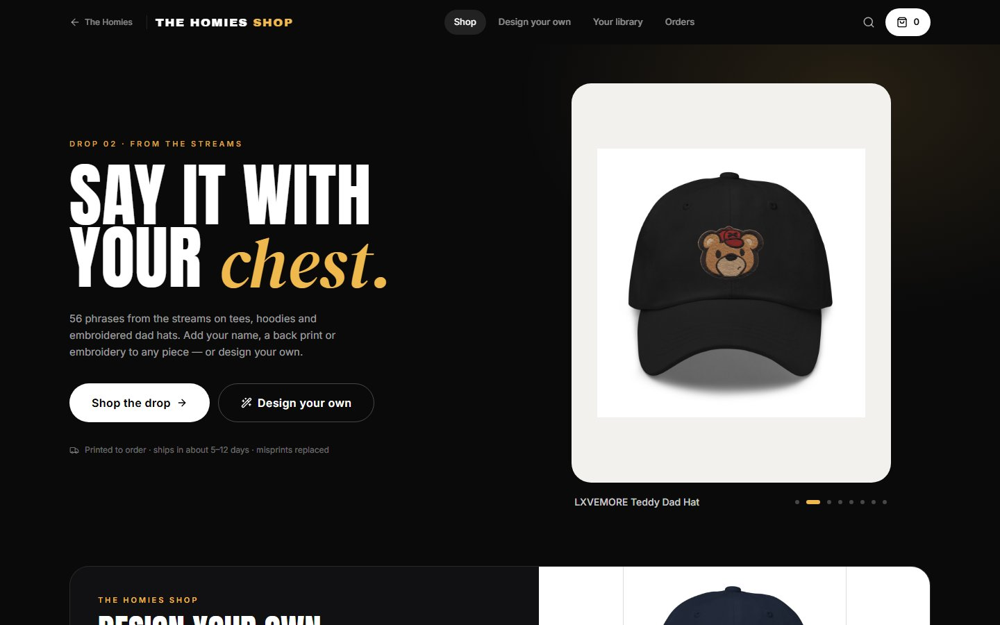
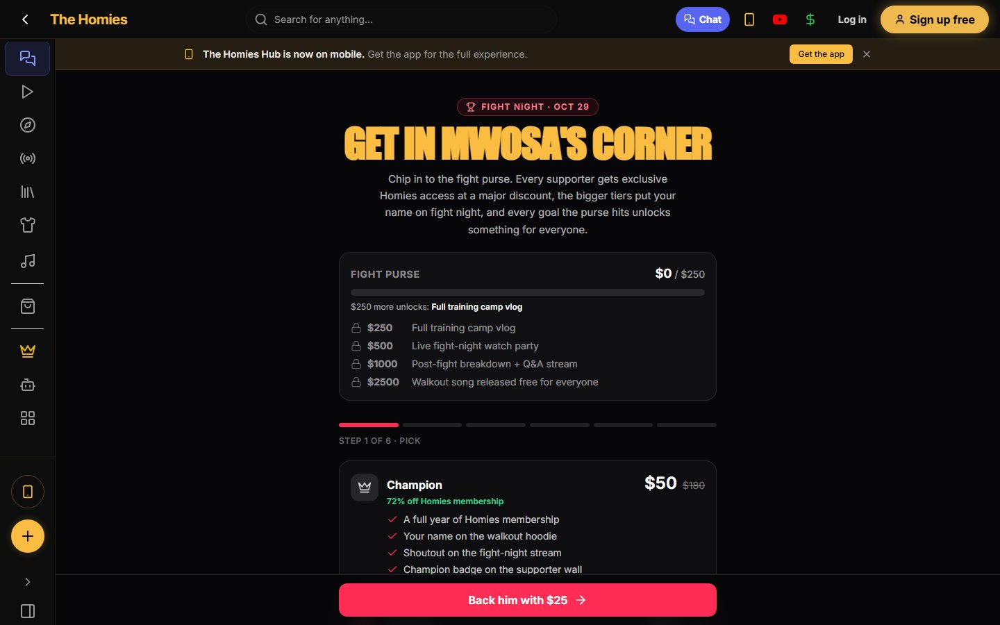
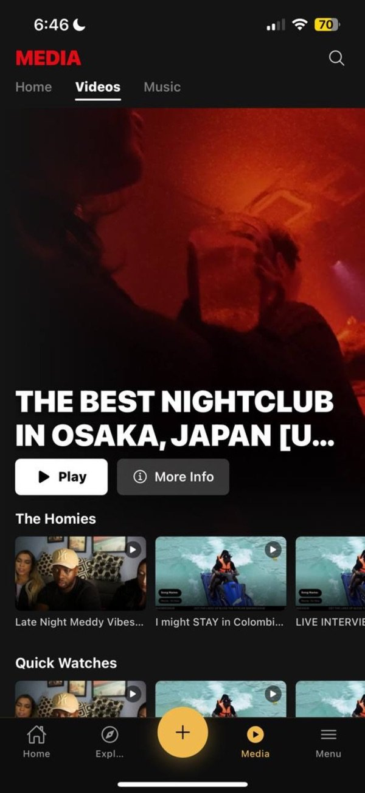
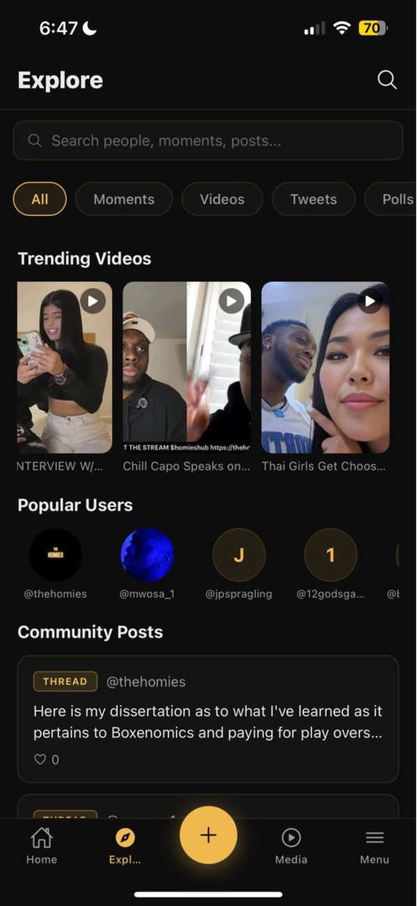
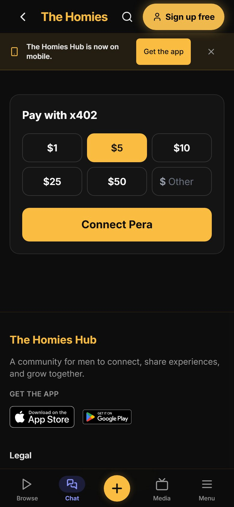
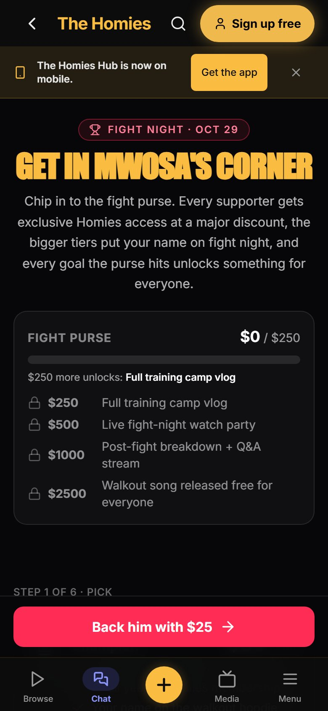
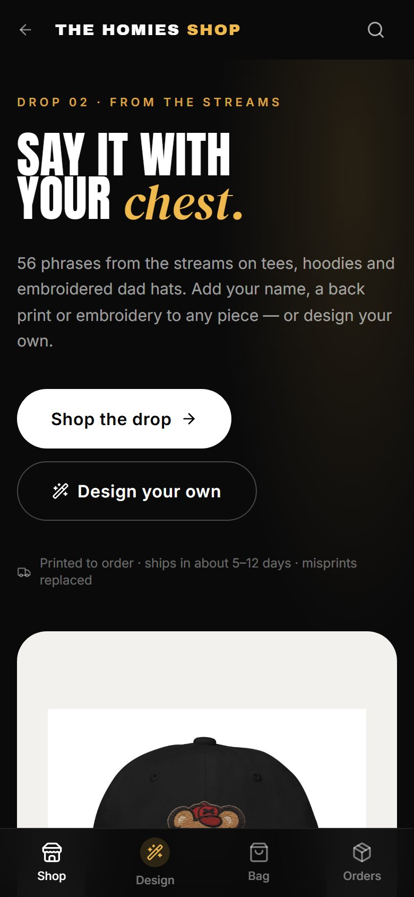
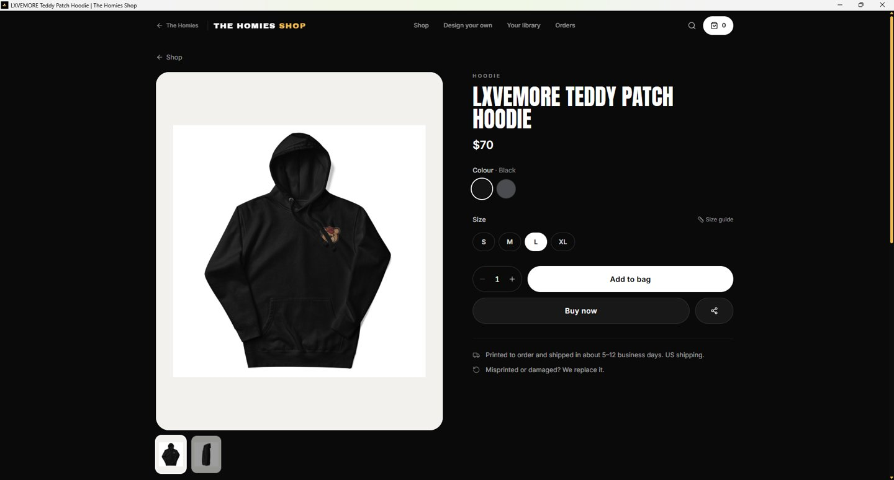

# DIGITVL × The Homies: x402 payments for creator communities

**DIGITVL** is infrastructure for creators to build their own community ecosystems: their own app, their own audience, their own economy. Fans pay creators directly in **USDC on Algorand** over **x402**, settled through the **GoPlausible facilitator**, with no platform in the middle taking a cut months later.

**The Homies** is the first community ecosystem running on it. It belongs to **Mwosa**, the creator who founded both DIGITVL and The Homies. It's a real, active community with its own app on iOS, desktop and the web, its own chat, media library, merch shop and memberships. Fans now back Mwosa directly through x402 on this gateway.

**Take a real look:** **[thehomies.app](https://www.thehomies.app)** · [Pay with x402](https://www.thehomies.app/payx) · [Back the Oct 29 fight](https://www.thehomies.app/sponsor) · [The Homies Shop](https://www.thehomies.app/shop) · [iOS app](https://apps.apple.com/us/app/the-homies-hub/id6764137511) · [Desktop app (Windows / macOS / Linux)](https://github.com/georgejr6/thehomieshub-desktop-releases/releases/latest) · [DIGITVL](https://digitvl.app)

**Gateway (live, mainnet):** https://digitvl-x402-gateway-production.up.railway.app · agent manifest: [`/.well-known/x402`](https://digitvl-x402-gateway-production.up.railway.app/.well-known/x402)
**Demo video (3:25):** https://github.com/georgejr6/digitvl-x402-gateway/releases/download/v1.0/DIGITVL_x402_demo.mp4

---

## The Homies by the numbers

Pulled from The Homies production database on Oct 8, 2026:

| | |
|---|---|
| **629** community accounts | 237 who signed up directly in the app, plus 392 members brought over from the community's Discord |
| **13** paying members | monthly Homies memberships |
| **396** members in Homies Chat | **84,000+** chat messages (our own chat, built to replace Discord) |
| **1,191** unique visitors to thehomies.app since mid-June | **448** in the last 30 days |
| **106** videos · **130** songs · **31** livestreams | hosted in the app's own media library (Mux) |
| **1,000,000+** views | on Mwosa's long-form livestreams and videos |

## What the app does

- **Feed + Media mode.** A TikTok-style vertical feed and a Netflix-style library of Mwosa's streams, videos and music (DIGITVL's catalog). Free accounts get previews; members get everything.
- **Homies Chat.** The community's own Discord-style chat: channels, roles, DMs, reactions, a points system that rewards active members, and a leaderboard.
- **Live.** In-app livestreams with live chat and card or crypto tips.
- **The Homies Shop.** Merch printed to order. Every item is customizable in the built-in design studio, and active members earn points toward discounts or free merch.
- **Memberships.** Paid tiers unlock full media access, and the money goes straight to the creator.
- **x402 fan support (this gateway).** Fans back Mwosa directly in USDC from their own wallet. See below.

## Screenshots

**Web** ([thehomies.app](https://www.thehomies.app))

| Home | Media mode |
|---|---|
|  |  |
| **The Homies Shop** | **Back the fight (x402)** |
|  |  |

**iOS app** ([App Store](https://apps.apple.com/us/app/the-homies-hub/id6764137511)) and **mobile web**

| Media | Explore | Pay with x402 | Back the fight | Shop |
|---|---|---|---|---|
|  |  |  |  |  |

**Desktop app** (Windows, also on macOS and Linux)



---

## How x402 powers it

| Endpoint | Price | Who uses it |
|---|---|---|
| `GET /support?amount=<usd>&ref=<intent>` | $1–$500 USDC, chosen by the fan | Fans backing Mwosa from [thehomies.app/sponsor](https://www.thehomies.app/sponsor) (perk tiers: wall shoutout, membership, name on the walkout hoodie) and [thehomies.app/payx](https://www.thehomies.app/payx) (no account needed) |
| `GET /unlock?track_id=<uuid>` | $0.05 USDC | Pay-per-unlock of a DIGITVL track: people or AI agents |
| `GET /tracks` | free | Browse the DIGITVL catalog |
| `GET /.well-known/x402` | free | Machine-readable merchant manifest for agents |

**A fan backing the fight:**
1. On thehomies.app the fan picks a tier or a custom amount and connects their own Algorand wallet (Pera). The app helps them get USDC if they have none.
2. The app calls `GET /support?amount=25&ref=<signed intent>`. The gateway answers **HTTP 402** with the x402 challenge: scheme `exact`, Algorand mainnet, USDC (ASA `31566704`), Mwosa's payout address, and GoPlausible's fee payer, so the fan needs no ALGO.
3. The fan's wallet signs the USDC transfer. The gateway has GoPlausible **verify** it (simulating the atomic group) and then **settle** it on-chain.
4. After settlement the gateway reports the payment to The Homies backend, which checks it on-chain and grants the perks (membership, hoodie name, wall spot). The `ref` is HMAC-signed, so perks can't be claimed without a real settled payment.

The money moves fan → creator in seconds. x402 is the payment path itself, not a checkout bolted on next to it.

**Real settled payments from fans** (USDC to Mwosa's DIGITVL wallet, all through the facilitator):
- [`6AQDLUES2DLVFCQZMFL4MTXOX7ZAO4S5CQYTQRA2PR7LYNDMHXYA`](https://allo.info/tx/6AQDLUES2DLVFCQZMFL4MTXOX7ZAO4S5CQYTQRA2PR7LYNDMHXYA): 22 USDC, Oct 8
- [`OXQVNJXA2NA5XMH2Y24GCHOJOYNKJ7ZUF5MY57RSNCA27TKMJHSA`](https://allo.info/tx/OXQVNJXA2NA5XMH2Y24GCHOJOYNKJ7ZUF5MY57RSNCA27TKMJHSA): 28 USDC, Oct 6
- [`X3UK372SRUD7QARXJX66XN4IZHPZVELXMLZTGDZXDBT3WHWNW2AQ`](https://allo.info/tx/X3UK372SRUD7QARXJX66XN4IZHPZVELXMLZTGDZXDBT3WHWNW2AQ): first mainnet settlement (0.05 USDC music unlock), Sep 30

Every paid route declares **Bazaar discovery** metadata and the `x402-global-challenge` tag, so agents can find and call it from the GoPlausible Bazaar. The code also contains `/bet` for fan prediction pools on a separate Algorand app. It is switched off (503) and not live.

## Why this matters

Streaming platforms pay creators fractions of a cent, months later, through layers of middlemen, and the audience lives on someone else's platform. DIGITVL flips that: the creator owns the community (The Homies app), and every fan payment, whether backing a fight, unlocking a track or soon buying merch, settles straight to the creator's wallet over x402. The Homies is the template for the next creator community on DIGITVL.

## Run it

```bash
npm install
ALGO_PAY_TO_ADDRESS=<creator payout address> \
DIGITVL_CATALOG_API_KEY=<catalog key> \
FACILITATOR_URL=https://facilitator.goplausible.xyz \
FIGHT_GATEWAY_SECRET=<shared secret with the community backend> \
npm start
```

Tests: `npm test`. Built on the official x402 v2 packages (`@x402/hono`, `@x402/avm`, `@x402/core`, `@x402-avm/extensions`), following the Algorand Foundation's x402 demo.
